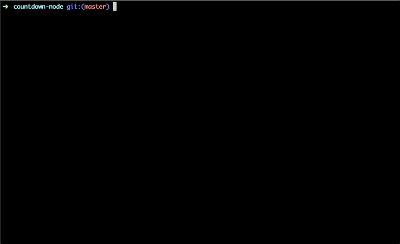

# Countdown

[](https://github.com/prettier/prettier)

<p align="center"></p>

## Usage

Specify duration in go format `1h2m3s`.

```bash
yarn countdown 25s
```

## Install

```
yarn clone https://github.com/harrisgeo88/countdown
cd countdown
yarn install
```

## Licence

MIT